# Food App Business Analysis

 

## Table of Contents
- [Project Overview](#project-overview)
- [About The Dataset](#about-the-dataset)
- [Tools Used](#tools-used)
- [Visualization in Power BI:](#visualization-in-power-bi)
- [Project Analysis](#project-analysis)
- [Visuals in Power BI Report](#visuals-in-power-bi-report)
- [Recommendations Towards The Growth and Proftability of The Food App Business](#recommendations-towards-the-growth-and-proftability-of-the-food-app-business)
 

## Project Overview
### Introduction:
In today's digital age, the food industry has witnessed a significant transformation with the advent of food sales and delivery business applications. These applications have revolutionized the way people order, consume, and experience food. This project aims to conduct a comprehensive analysis of the food app business, focusing on various aspects including market trends, customer demography, customer behavior, customer income, costumer purchase method, and provide insights for potential business growth.

### Objectives:
- To analyze the customer demography and the role their age, income, education status, and marital status plays in their Food purchase preferences
- To analyze customer preferences and behaviors regarding food ordering and delivery.
- To analyze the effects of food campaigns on food sales for this food app business.
- To analyze the amount spent on food categories and purchasing method as influenced by customer demorgraphy
- To assess the impact of technological advancements on the food app business.
- To provide insights and recommendations for businesses operating in this space.

### Expected Findings:
1.  __Analysis of Customer Demography and Purchase Preferences:__
     - Understanding how age, income, education status, and marital status influence food purchase preferences.
     - Segmentation of customer preferences based on demographic factors to tailor marketing strategies.

2. __Customer Preferences and Behaviors Regarding Food Ordering and Delivery:__
     - Identification of preferred food categories, pricing sensitivity, and delivery preferences.
     - Analysis of factors influencing customer loyalty and satisfaction, such as delivery time and food quality.

3. __Effect of Food Campaigns on Food Sales:__
     - Evaluation of the impact of marketing campaigns and promotions on food sales.
     - Assessment of the effectiveness of different marketing channels in driving customer engagement and sales.

4. __Amount Spent on Food Categories and Purchasing Method by Demography:__
     - Analysis of spending patterns across different food categories (e.g., wines, meat, fish, sweet, fruits , gold).
     - Understanding how demographic factors influence the choice of purchasing method (e.g., store purchsases, web purchases, catalog purchases).

5. __Impact of Technological Advancements:__
     - Assessment of the role of technological innovations such as AI, data analytics, and delivery logistics in improving customer experience and operational efficiency.
     - Identification of emerging technologies with the potential to disrupt the food app business landscape.

6. __Insights and Recommendations for the food app Business:__
     - Providing actionable insights for the food app business to enhance their offerings, improve customer engagement, and stay competitive.
     - Recommendations for leveraging technology, optimizing marketing strategies, and catering to specific demographic segments effectively.
 
 

### About The Dataset
The "FoodAppBusiness.csv" dataset contains information related to the operations and transactions of a food app business. It includes various attributes that capture customer demographics, purchase preferences, transaction details, marketing campaigns, and technological advancements. The dataset is stored in a CSV (Comma Separated Values) format.
Each row represents a single observation or transaction, with each column capturing different attribute. The dataset has 27 columns and 2,205 rows. The dataset is in .csv file and can be viewed or downloaded [here](FoodAppBusiness.csv)

here's an overview of the "FoodAppBusiness.csv" dataset along with explanations of the column names:
1. __MonthlyIncome:__ Monthly income of the customer.
2. __ActiveSinceDays:__ Number of days since the customer has been active on the food app.
3. __Age:__ Age of the customer.
4. __Graduate:__ Binary variable indicating whether the customer is a graduate (1) or not (0).
5. __Married:__ Binary variable indicating whether the customer is married (1) or not (0).
6. __Single:__ Binary variable indicating whether the customer is single (1) or not (0).
7. __NoOfChildren:__ Number of children the customer has.
8. __NoOfTeenager:__ Number of teenagers the customer has.
9. __NoOfDaysSinceLastPurchase:__ Number of days since the customer's last purchase on the food app.
10. __AmountSpentOnWines:__ Amount spent by the customer on wines.
11. __AmountSpentOnFruits:__ Amount spent by the customer on fruits.
12. __AmountSpentOnMeat:__ Amount spent by the customer on meat.
13. __AmountSpentOnFish:__ Amount spent by the customer on fish.
14. __AmountSpentOnSweet:__ Amount spent by the customer on sweets.
15. __AmountSpentOnGold:__ Amount spent by the customer on gold.
16. __NoOfDealsWithDiscount:__ Number of deals the customer accepted with a discount.
17. __NoOfWebPurchase:__ Number of purchases made by the customer via the web.
18. __NoOfCatalogPurchase:__ Number of purchases made by the customer via catalogs.
19. __NoOfStorePurchase:__ Number of purchases made by the customer in-store.
20. __NoOfWebVisitsMonth:__ Number of web visits made by the customer in a month.
21. __PurchasedIn1stCampaign:__ Binary variable indicating whether the customer made a purchase during the first campaign (1) or not (0).
22. __PurchasedIn2ndCampaign:__ variable indicating whether the customer made a purchase during the second campaign (1) or not (0).
23. __PurchasedIn3rdCampaign:__ variable indicating whether the customer made a purchase during the third campaign (1) or not (0).
24. __PurchasedIn4thCampaign:__ variable indicating whether the customer made a purchase during the fourth campaign (1) or not (0).
25. __PurchasedIn5thCampaign:__ variable indicating whether the customer made a purchase during the fifth campaign (1) or not (0).
26. __TotalNoOfCampaignAccepted:__ Total number of marketing campaigns accepted by the customer.
23. __CustomerComplain:__ Binary variable indicating whether the customer has complained (1) or not (0).
 

### Skills Utilized
1. Data Cleaning
2. Data Visualiziation
3. Descriptive Analytics
4. Critical Thinking and Problem Solving
5. Communication and Reporting
 

### Tools Used
1. MS Sql Server
    - Was used to:
        1. Extract,
        2. Clean,
        3. Transform, and
        4. Load all the datasets for this analysis.
           
2. Power BI (Was used to create reports and dashboard for this analysis)
    - The following Power BI Features were incorporated:
        1. DAX
        2. Quick Measures
        3. Page Navigation
        4. Filters
        5. Tooltips
        6. Button
 

### Data Cleaning, Transformation and Loading using the MS Sql Server:
1. Added a new column __"AgeBand"__ which extracts its information from the __"Age"__ column and groups them into: Twenties, Thirties, Forties, Fifties, Sixties, and Seventies+ using the 'If function'.
2. Added a new column __"Graduate_Status"__ which picks its information from the __"Graduate"__ column and transforms them by grouping them into __'Graduate'__ and __'Non-Graduate'__. using the 'If fdunction'.
3. Added a new column __"Marital_Status"__ from the __"Married"__ column groups the data in the __"Married"__ column into __'Married'__ and __'Single'__ using the 'If function'.
4. Changed all the columns to the right column types.
5. Re-ordered all columns accordingly (Power Query).
 

**Raw Data**
- Below is a screenshot of a part of the raw data in .csv file format which cannot be viewed fully here because of the enormous number of its columns (27 column). 

Raw Data Screenshot                                                               |                       
:---------------------------------------------------------------------------------:|
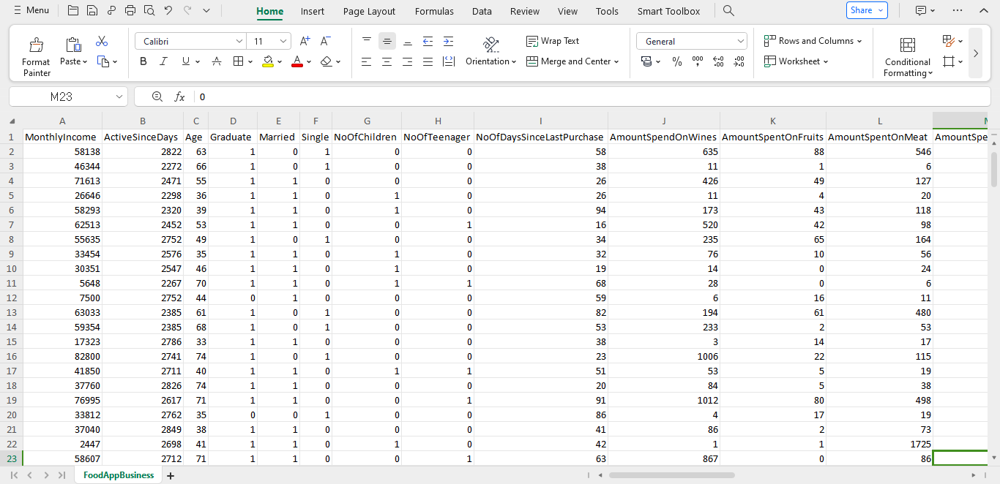

You can preview the dataset [here](FoodAppBusiness.csv).
 
 

**Final MS Sql Server screenshot**
- Below is a screenshot of a part of the cleaned data in MS Sql Server query editor which cannot be viewed fully here because of the rows of queries. You can access the complete Power BI project document [here](FOOD%20APP%20BUSINESS%20ANALYSIS.pbix).

Sql Query Screenshot                                                               |                       
:---------------------------------------------------------------------------------:|
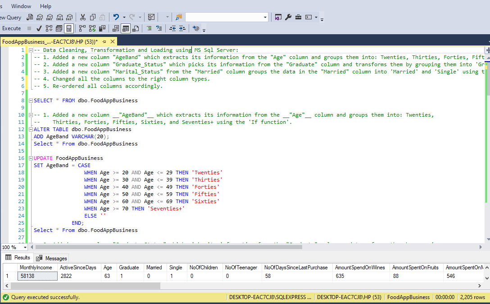   

You can preview the MS Sql Server query file [here](FoodAppBusiness_Query.sql)
 
 

## Data Modelling
No modelling was required since we need just a table for the analysis.
 
 

## Visualization in Power BI:
#### Report 1
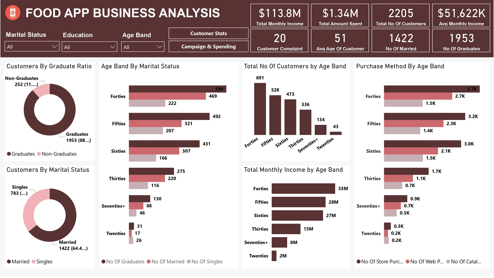

#### Report 2
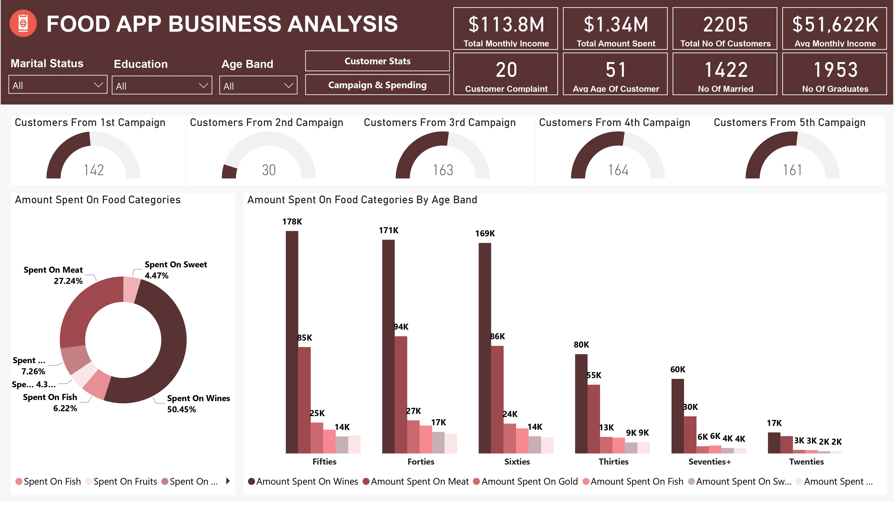
 
 

### Project Analysis:
From the analysis, i made the Key Performance Indcator findings below:
- The Total Monthly Income from this Food App Business data is __$113.8M.__
- The Average Monthly Income from this Food App Business is __$51.622k.__
- The Total Amount Spent on all the food categories is __$1.34M.__
- The Total Number of Customers in this analysis is __2,205.__
- The Average Age of Customers in this analysis is __51.__
- The number of Customers that are Married is __1,422__
- The number of Customers that are Graduates is __1,953__
- The number of Customer Complaint is __20.__
 
 

- 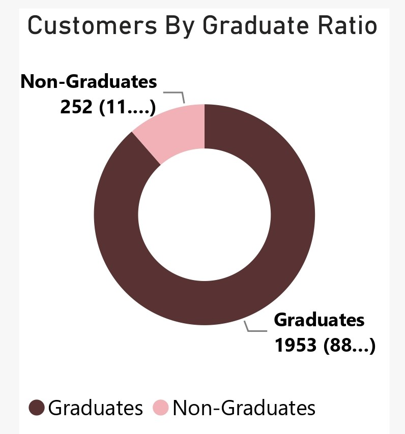

- **Customers By Graduate Ratio**
- Analyzing this data from the aspect of Customers educational level, in the doughnut pie that represents "Customers By Graduate Ratio", we can see that Graduates makes a greater percentage ratio and number of customers in this analysis with 1,953 customers and a percentage of 88.57% while the Non-Graduates Customers are 252 in number with a percentage share of 11.43%. From this chart, we can see that educational may have influence buying decisions of customers.
 
 

- 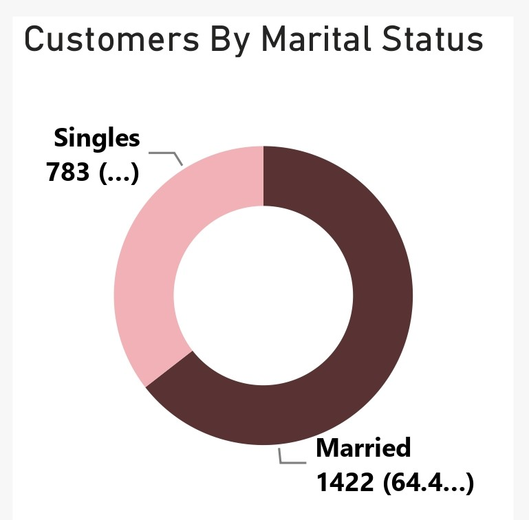

- **Customers By Marital Status**
- From the "Customers By Marital Status" doughnut chart, we could see that we have a graeater number of customers that are married with a customer count of 1,422 and a percentage ratio of 64.49% while the Singles has a customer count of 783 and a percentasge ratio of 35.51%. This indicates that we have a greater number of married customers in this analaysis and marital status must have played a role in the purchasing preferences, purchasing methods and the medium of purchases for these customers.
 
 

- 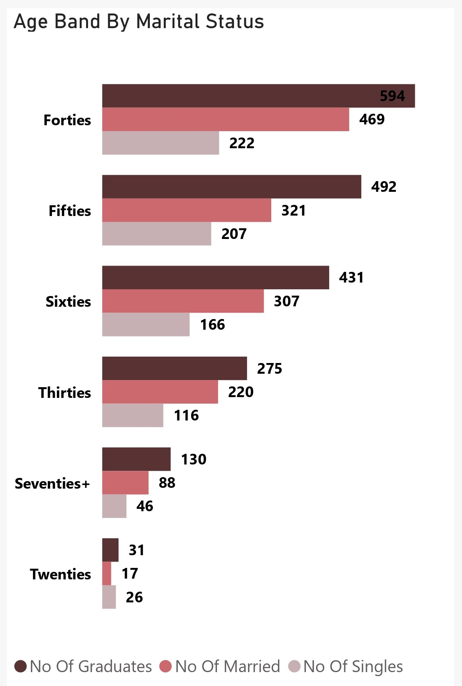

- **Age Band By Marital Status**
- Diving deeper into the customer demography analysis, in the "Age Band By Marital Status and Education" clustered horizontal bar chart, we could see insightful patterns regarding the distribution of customers across different age bands, marital statuses, and education levels. Here's a breakdown of the findings:
  - __Forties (40-49 years):__ This age band comprises the largest number of customers, with a total of 594 individuals. Among these customers, 469 are married, indicating a significant 
    portion of married individuals within this age group. Additionally, 222 customers in their forties are single.
  - __Fifties (50-59 years):__ Following closely, the age band of fifties accounts for 492 customers. Among them, 321 are married, indicating a relatively higher proportion of married 
    individuals compared to singles. 207 customers in their fifties are single.
  - __Sixties (60-69 years):__ Customers in their sixties represent the third-largest group, totaling 431 individuals. Within this age band, 307 customers are married, with a 
    significant portion opting for marriage. There are 166 single customers in their sixties.
  - __Thirties (30-39 years):__ The age band of thirties comprises 275 customers, ranking fourth in terms of customer count. Among them, 220 customers are married, showing a 
    considerable proportion of married individuals. Additionally, 119 customers in their thirties are single.
  - __Seventy+ (70+ years):__ Customers aged seventy and above account for 130 individuals. Among them, 88 customers are married, with a notable representation of married individuals in 
    this age group. Additionally, there are 46 single customers in this age band.
  - __Twenties (20-29 years):__ The age band of twenties represents the smallest group of customers, with a total count of 31 individuals. Interestingly, among these customers, there 
    are 17 married individuals and 26 single individuals, indicating a higher proportion of singles compared to married individuals in this age group.
  - This analysis provides valuable insights into the composition of the customer base. A good understanding of these demographic patterns can help the food app business tailor 
    marketing strategies, product offerings, and customer engagement initiatives to better cater to the preferences and needs of different customer segments. Further analysis and 
    segmentation based on demographic factors can provide deeper insights and opportunities for targeted marketing and personalized experiences to enhance customer satisfaction and 
    loyalty.
 
 

- 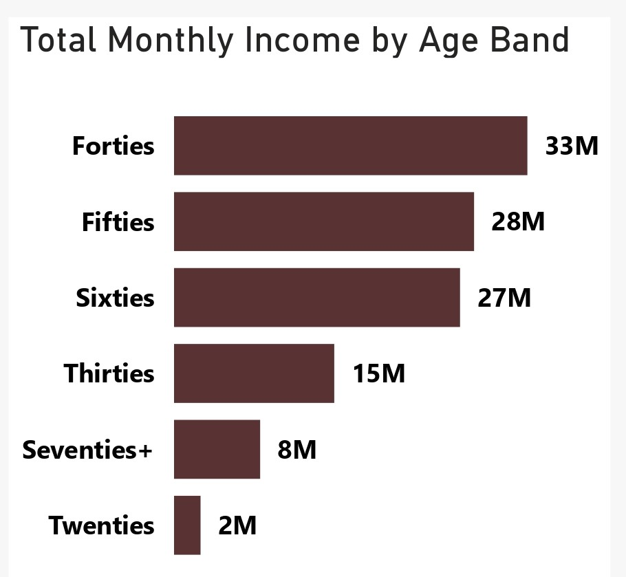

- **Total Monthly Income By Age Band**
- The distribution of total monthly income across different age bands provides valuable insights into customers' purchasing power and preferences. Here's an analysis of how income levels may influence their buying behavior:
  - __Forties (40-49 years):__ Customers in their forties, with the highest total monthly income of $33 million, likely have significant purchasing power. They may prioritize quality 
    and convenience in their purchases, opting for higher-priced products and services. Preferences may include preference in luxury items within the food categories.
  - __Fifties (50-59 years):__ With a total monthly income of $28 million, customers in their fifties also possess substantial purchasing power. They may prioritize value for money and 
    reliability in their purchases, seeking food products that offer longevity. Preferences may include home improvements, health and wellness food products.
  - __Sixties (60-69 years):__ Despite having a slightly lower total monthly income of $27 million, customers in their sixties still maintain considerable purchasing power. They may 
    prioritize convenience and comfort in their purchases, opting for food products and services that enhance their lifestyle and well-being. Preferences may include healthcare products.
  - __Thirties (30-39 years):__ With a total monthly income of $15 million, customers in their thirties exhibit moderate purchasing power. They may prioritize affordability and value in 
    their food purchases, seeking products and services that offer a balance between quality and cost-effectiveness. Preferences may include food products that align with their 
    lifestyle and aspirations.
  - __Seventies+ (70+ years):__ Despite having a lower total monthly income of $8 million, customers aged seventy and above still possess purchasing power, albeit relatively lower 
    compared to younger age groups. They may prioritize simplicity and reliability in their purchases, opting for food products and services that meet their basic needs and preferences. 
    Preferences may include healthcare products, household food essentials, and investments in food prducts that helps them maintain their quality of life.
  - __Twenties (20-29 years):__ Customers in their twenties, with the lowest total monthly income of $2 million, may have limited purchasing power compared to older age groups. They may 
    prioritize affordability and novelty in their purchases, seeking products and services that align with their budget constraints and evolving preferences. Preferences may include 
    trendy food products and experiences that cater to their social and recreational interests.
  - Lastly, he distribution of total monthly income across different age bands influences customers' purchasing power and preferences, shaping their buying behavior and consumption 
    patterns. Understanding these changes is crucial for the Food App Business to tailor their product offerings, pricing strategies, and marketing campaigns to effectively target and 
    engage with diverse customer segments. By aligning with customers' income levels and preferences, businesses can optimize their market positioning and enhance customer satisfaction, 
    ultimately driving sales and fostering long-term loyalty.
 
 

- 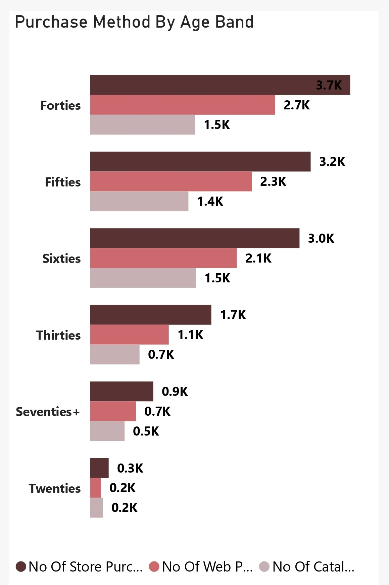

- **Purchase Method By Age Band**
- This analysis sheds light on how age influences the choice of purchase method. Here's an analysis of the findings:
  - __Forties (40-49 years):__ Customers in their forties demonstrate a preference for store purchases, with 3,740 transactions recorded. They also show significant engagement in web 
    purchases, with 2,661 transactions, indicating comfort with online shopping. Catalog purchases, totaling 1,510 transactions, reflect a supplementary channel for their shopping 
    needs. The forties age group exhibits a balanced approach to purchasing, utilizing both traditional and digital channels based on convenience and preference.
  - __Fifties (50-59 years):__ Similar to customers in their forties, those in their fifties display a preference for store purchases, with 3,171 transactions. Web purchases, totaling 
    2,324 transactions, also show a significant level of engagement, indicating a growing comfort with online shopping among older demographics. Catalog purchases, with 1,414 
    transactions, serve as an additional avenue for their shopping requirements. The fifties age group showcases a similar purchasing pattern to the forties, leveraging both offline 
    and online channels based on convenience and familiarity.
  - __Sixties (60-69 years):__ Customers in their sixties exhibit a preference for store purchases, with 3,011 transactions, indicating a continued reliance on traditional shopping 
    methods. Web purchases, totaling 2,110 transactions, show a notable level of adoption, reflecting increasing digital literacy and comfort with online transactions among older age 
    groups. Catalog purchases, with 1,518 transactions, maintain a presence as an alternative shopping channel for this demographic. The sixties age group demonstrates a 
    gradual transition towards online shopping while still retaining a preference for traditional retail experiences.
  - __Thirties (30-39 years):__ Customers in their thirties display a preference for store purchases, with 1,743 transactions, indicating a reliance on brick-and-mortar retail outlets. 
    Web purchases, totaling 1,131 transactions, demonstrate moderate engagement in online shopping, reflecting a growing trend towards digital commerce among younger demographics. 
    Catalog purchases, with 711 transactions, serve as a supplementary channel for their shopping needs but are less prevalent compared to older age groups. The thirties age group 
    exhibits a balanced approach to purchasing, with a slight inclination towards traditional retail but a growing presence in online transactions.
  - __Seventies+ (70+ years):__ Customers aged seventy and above primarily rely on store purchases, with 909 transactions, reflecting a preference for traditional shopping experiences. 
    Web purchases, totaling 659 transactions, show a lower level of engagement compared to younger age groups but indicate a gradual adoption of online shopping among older 
    demographics. Catalog purchases, with 496 transactions, serve as a supplementary channel for this age group, providing additional convenience for their shopping needs. The seventy 
    and above age group demonstrates a cautious approach to online transactions while maintaining a preference for familia retail environments.
  - __Twenties (20-29 years):__ Customers in their twenties predominantly engage in store purchases, with 267 transactions, reflecting a preference for immediate gratification and in- 
    store experiences. Web purchases, totaling 157 transactions, indicate moderate engagement in online shopping, with a growing trend towards digital commerce among younger 
    demographics. Catalog purchases, with 184 transactions, serve as a secondary channel for this age group, catering to specific shopping preferences or niche food products. The 
    twenties age group demonstrates a balanced approach to purchasing, with a preference for traditional retail supplemented by 
    increasing engagement in online transactions.
  - Age plays a significant role in influencing the choice of purchase method, with different age groups demonstrating varying preferences and levels of engagement across store, web, 
    and catalog purchases. A good understanding of these preferences is important for the Food App Business to tailor their omnichannel strategies, offering a seamless shopping 
    experience that caters to the diverse needs and preferences of different demographic segments. By adapting their marketing efforts and enhancing their online and offline retail 
    offerings, businesses can effectively engage with customers across all age groups, driving sales and fostering long-term loyalty in an increasingly competitive retail landscape.
 
 

- 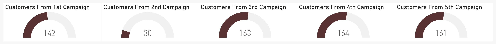

- **No Of Customers Acquired By Campaigns**
- This analysis provides valuable insights into the effectiveness of different campaign strategies. Here's an analysis of the factors that may have influenced the varying levels of success across the campaigns:
  - __4th Campaign (164 customers converted):__ The 4th campaign emerged as the most successful, converting 164 customers.          
    - __Potential Influencing Factors:__ Targeted Messaging: The campaign may have effectively communicated value propositions and incentives that resonated with the target audience, 
      prompting a higher conversion rate.
    - __Timing and Relevance:__ The campaign might have been strategically timed to coincide with consumer needs or market trends, increasing its relevance and impact.
    - __Personalization:__ Tailoring the campaign message and offers to individual customer preferences and behaviors may have enhanced engagement and conversion rates.
  - __3rd Campaign (163 customers converted):__ Following closely, the 3rd campaign converted 163 customers, indicating a high level of success.
    - __Potential Influencing Factors:__
      - __Compelling Offers:__ The campaign may have featured compelling discounts, promotions, or incentives that incentivized customers to take action and make a purchase.
      - __Multiple channel Approach:__ Leveraging multiple marketing channels and touchpoints may have extended the campaign's reach and engagement, resulting in higher conversion rates.
      - __Customer Segmentation:__ Targeting specific customer segments with tailored messaging and offers may have contributed to higher 
        response rates and conversions.
  - __5th Campaign (161 customers converted):__ The 5th campaign secured the third position with 161 customers converted.
    - __Potential Influencing Factors:__
      - __Creative Messaging:__ Innovative and attention-grabbing messaging or creative content may have captured the audience's interest and motivated them to respond positively to the 
        campaign.
      - __Call to Action:__ Clear and compelling calls to action (CTAs) may have encouraged customers to take the desired action, resulting in a higher conversion rate.
      - __Customer Engagement:__ Interactive elements or gamification strategies incorporated into the campaign may have enhanced customer engagement and participation, leading to 
        increased conversions.
  - __1st Campaign (142 customers converted):__ The 1st campaign secured the fourth position, converting 142 customers.
    - __Potential Influencing Factors:__
      - __Brand Awareness:__ As the initial campaign in the series, the 1st campaign may have focused on building brand awareness and introducing the target audience to the product or 
        service offering.
      - __Testing and Optimization:__ The campaign may have served as a testing ground for different messaging, offers, and channels, with learnings used to refine subsequent campaigns 
        for improved performance.
      - __Market Conditions:__ External factors such as seasonality, economic conditions, or competitive landscape may have influenced the campaign's effectiveness and conversion rates.
  - __2nd Campaign (30 customers converted):__ The 2nd campaign experienced the lowest level of success, converting only 30 customers.
    - __Potential Influencing Factors:__
      - __Messaging Alignment:__ The campaign messaging may have failed to effectively communicate value or relevance to the target audience, resulting in limited engagement and 
        conversion.
      - __Targeting Issues:__ Inaccurate audience targeting or insufficient segmentation may have led to the campaign reaching the wrong audience or failing to resonate with the 
        intended recipients.
      - __Execution Challenges:__ Issues related to campaign execution, such as technical errors, delivery delays, or poor creative quality, may have hindered its effectiveness and 
        conversion rates.
- The varying levels of success observed across the campaigns may be attributed to a combination of factors including messaging effectiveness, timing, relevance, personalization, creative execution, and audience targeting. Analyzing the performance of each campaign provides valuable insights for optimizing future marketing initiatives, identifying best practices, and addressing areas for improvement to drive higher conversion rates and overall campaign success.
 
 

- 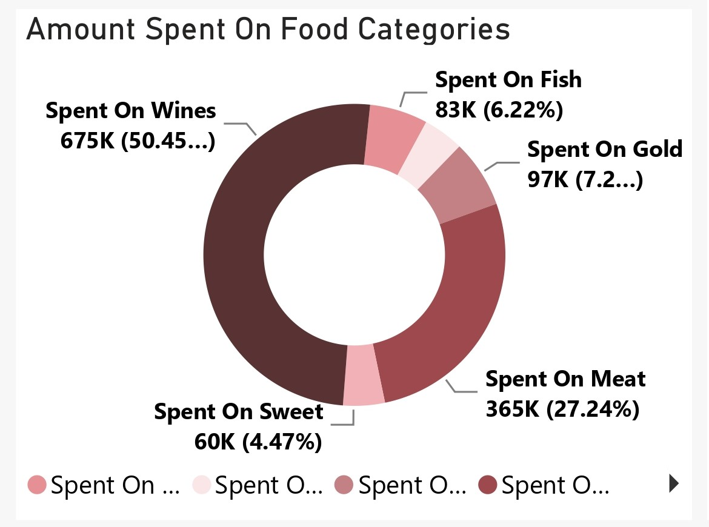

- **Amount Spent On Food Categories**
- This analysis provides insights into consumer preferences and purchasing behavior. Here's an analysis based on the food categories 
  details:
- __Wines:__ Wines emerge as the top category in terms of total amount spent, with a substantial $675,093, representing a significant share 
  ratio of 50.45%.
   - __Potential Influencing Factors:__
     - __Lifestyle Preferences:__ Consumers may prioritize purchasing wines for social occasions, celebrations, or personal enjoyment, contributing to higher expenditure in this 
       category.
     - __Perceived Value:__ Premium wines may command higher prices, leading to increased spending among consumers who perceive wine as a status symbol or luxury item.
     - __Seasonal Trends:__ Factors such as holidays, special events, or cultural traditions may influence wine consumption patterns, leading to fluctuations in spending within this 
       category.
- __Meat:__ Meat follows closely behind wines in terms of total amount spent, with $364,513, comprising a substantial share ratio of 27.24%.
   - __Potential Influencing Factors:__
     - __Dietary Preferences:__ Meat is a staple protein source in many diets, leading to consistent demand and expenditure within this category.
     - __Culinary Trends:__ Consumers may allocate significant budgets for premium cuts of meat or specialty products, driven by culinary trends, health considerations, or cultural 
       preferences.
     - __Occasional Purchases:__ Purchases of meat for special occasions, barbecues, or family gatherings may contribute to higher expenditure within this category during certain 
       periods.
- __Gold:__ Gold represents a unique category within food spending, with a total amount spent of $97,146 and a share ratio of 7.26%.
   - __Potential Influencing Factors:__
     - __Luxury Consumption:__ Gold-coated or edible gold products may be considered luxury items or novelty gifts, leading to higher expenditure among consumers seeking indulgent 
       experiences.
     - __Special Occasions:__ Gold-based food products may be purchased for special events, celebrations, or as part of gourmet dining experiences, contributing to occasional spikes in 
       spending within this category.
     - __Cultural Significance:__ Gold has symbolic value in many cultures, influencing consumption patterns and expenditure within this category among certain demographic segments.
- __Fish:__ Fish ranks fourth in terms of total amount spent, with $83,253, and a share ratio of 6.22%.
   - __Potential Influencing Factors:__
     - __Health Consciousness:__ Fish is often perceived as a healthy protein source rich in omega-3 fatty acids, leading to consistent demand and expenditure within this category among 
       health-conscious consumers.
     - __Culinary Diversity:__ Consumers may allocate budgets for a variety of fish species, seafood products, driven by culinary diversity, taste preferences, and cultural influences.
     - __Seasonal Availability:__ Factors such as seasonal fishing quotas, weather conditions, or environmental concerns may influence the availability and pricing of fish, leading to 
       fluctuations in spending within this category.
- __Sweet:__ Sweet products represent a category of indulgent treats, with a total amount spent of $59,818 and a share ratio of 4.47%.
   - __Potential Influencing Factors:__
     - __Occasional Indulgence:__ Sweet products such as desserts, chocolates, or confectionery items are often purchased for special occasions, celebrations, or as indulgent treats, 
       contributing to periodic spikes in spending within this category.
     - __Emotional Comfort:__ Consumers may seek comfort or stress relief through the consumption of sweet products, leading to consistent demand and expenditure within this category 
       during certain periods.
     - __Gifting and Sharing:__ Sweet products are popular choices for gifting or sharing with friends and family, especially during holidays or festive seasons, driving higher 
       expenditure within this category.
- __Fruits:__ Fruits represent a category of fresh produce, with a total amount spent of $58,219 and a share ratio of 4.35%.
   - __Potential Influencing Factors:__
     - __Dietary Preferences:__ Fruits are perceived as healthy, nutritious options and are often included in balanced diets, leading to consistent demand and expenditure within this 
       category among health-conscious consumers.
     - __Seasonal Availability:__ The availability of seasonal fruits may influence purchasing patterns and expenditure within this category, with consumers allocating budgets for a 
       variety of fresh produce based on seasonal availability and preferences.
     - __Culinary Uses:__ Fruits are versatile ingredients used in various culinary applications, including desserts, smoothies, salads, and savory dishes, driving expenditure within 
       this category among consumers seeking culinary diversity and experimentation.
- This analysis highlights the diverse preferences and consumption patterns of consumers, with significant expenditure observed across various categories. An understanding of the factors influencing spending within each category is essential for the Food App Business to tailor their product offerings, marketing strategies, and promotional activities to effectively meet consumer needs and drive sales.
 
 

- 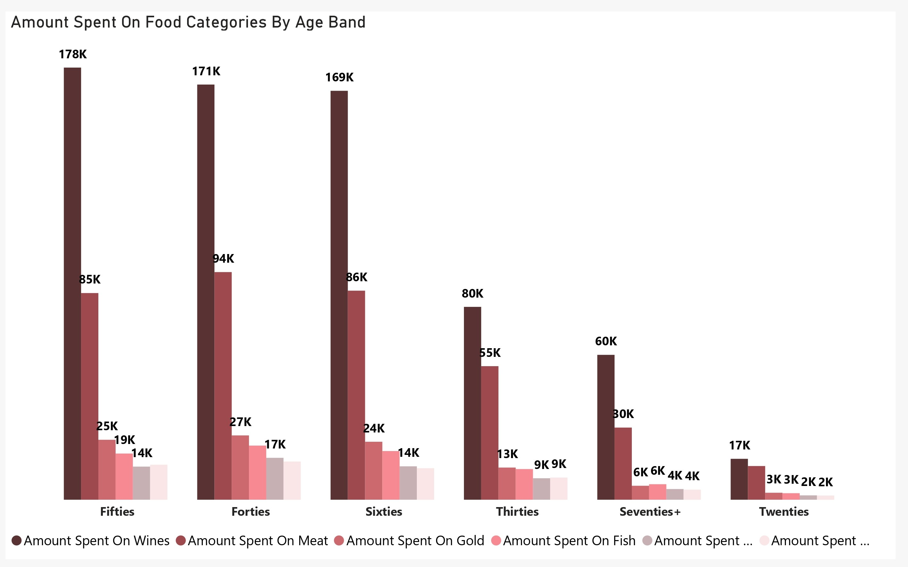

- **Amount Spent On Food Categories By Age Band**
- This analysis provides insights into consumer spending behavior and preferences across various demographic segments. Here's an analysis based on this details:
- __Age Band of Fifties:__ Customers in their fifties demonstrate significant expenditure across various food categories, with the highest amounts spent on Wines ($178,449) and Meat 
  ($85,341).
  - __Potential Influencing Factors:__
    - __Lifestyle Preferences:__ Consumers in their fifties may prioritize quality dining experiences and entertaining guests, leading to higher expenditure on wine and meat products.
    - __Financial Stability:__ With established careers and potentially higher disposable incomes, customers in their fifties may feel more comfortable investing in premium food items.
    - __Health Considerations:__ Balanced diets and nutritional awareness may influence spending on a variety of food categories, including meat, fish, fruits, and sweets.
- __Age Band of Forties:__ Customers in their forties also exhibit substantial spending on food categories, with notable amounts allocated to Wines ($171,443) and Meat ($93,999).
  - __Potential Influencing Factors:__
    - __Family and Social Occasions:__ Customers in their forties may allocate budgets for social gatherings, family dinners, and entertaining purposes, driving expenditure on wine and 
      meat products.
    - __Lifestyle Choices:__ Preferences for gourmet dining experiences or culinary indulgences may influence spending on premium food items such as wine, meat, and gold products.
    - __Health and Wellness:__ Awareness of dietary habits and nutritional needs may impact spending on healthier options such as fruits and fish, reflecting a balanced approach to food 
      consumption.
- __Age Band of Sixties:__ Customers in their sixties maintain consistent spending patterns across food categories, with notable amounts allocated to Wines ($168,857) and Meat ($83,322).
  - __Potential Influencing Factors:__
    - __Culinary Preferences:__ Established culinary tastes and preferences may drive spending on favorite food items such as wine and meat products among customers in their sixties.
    - __Social Engagement:__ Socializing with peers and hosting gatherings may contribute to higher expenditure on food and beverage items, including wine, meat, and sweets.
    - __Health Consciousness:__ Health considerations may influence spending on nutritious options such as fruits and fish, reflecting a desire for balanced and wholesome eating habits.
- __Age Band of Thirties:__ Customers in their thirties exhibit moderate spending across food categories, with lower amounts allocated to Wines ($79,637) and Meat ($55,150).
  - __Potential Influencing Factors:__
    - __Lifestyle Factors:__ Customers in their thirties may prioritize convenience and affordability in their food choices, leading to moderate spending across various categories.
    - __Career and Financial Considerations:__ Early career stages and financial responsibilities may influence spending habits, with a focus on value-oriented purchases and budget- 
      conscious decisions.
    - __Health and Wellness Trends:__ Growing health consciousness may drive spending on nutritious options such as fruits and fish, reflecting a desire for healthier eating habits 
      among younger consumers.
- __Age Band of Seventies+:__ Customers aged seventy and above exhibit conservative spending patterns across food categories, with lower amounts allocated to Wines ($59,823) and Meat 
  ($29,789).
  - __Potential Influencing Factors:__
    - __Budget Constraints:__ Fixed incomes and retirement considerations may influence spending habits, leading to more conservative allocations across food categories.
    - __Dietary Preferences:__ Aging-related health concerns may impact food choices, with a focus on simpler, easy-to-prepare meals and fewer indulgences in premium food items.
    - __Social Dynamics:__ Changes in socializing habits and lifestyle preferences may contribute to reduced spending on food and beverage items, including wine, meat, and sweets.
- __Age Band of Twenties+:__ Customers in their twenties exhibit modest spending patterns across food categories, with lower amounts allocated to Wines ($16,884) and Meat ($13,912).
  - __Potential Influencing Factors:__
    - __Early Career and Lifestyle Choices:__ Customers in their twenties may prioritize affordability and convenience in their food choices, with a focus on budget-friendly options and 
      dining out experiences.
    - __Social and Recreational Spending:__ Limited discretionary income may impact spending on food and beverage items, with a focus on socializing and recreational activities rather 
      than premium food purchases.
    - __Health and Wellness Trends:__ Growing health consciousness may drive spending on nutritious options such as fruits and fish, reflecting a desire for healthier eating habits 
     among younger consumers.
- Lastly, this analysis highlights diverse spending patterns and preferences across different demographic segments. An understanding of thee factors influencing spending within each age band is essential for the Fppd App business to tailor their product offerings, pricing strategies, and marketing initiatives to effectively meet consumer needs and drive sales.
 
 

## Visuals in Power BI Report:
You can view and interact with this report on Food App Business analysis [here](https://app.powerbi.com/view?r=eyJrIjoiMWMyNjliODktMTIwNi00ZGYzLThhYmMtMDQzNDE3Nzk4OWJkIiwidCI6IjdlYzI5NjU5LTNjZjItNGYzZi1hYmIzLWE3MjJlZGY3ZmYyZCJ9).
 
 
 

## Recommendations Towards The Growth and Proftability of The Food App Business
Based on the analysis conducted on the Food App Business and the insights gained from various aspects such as customer demographics, purchase behavior, campaign effectiveness, and spending patterns, here are several recommendations aimed at fostering growth and profitability:
- __Enhance Personalization and Customer Engagement:__ Utilize data analytics to gain deeper insights into customer preferences, behaviors, and purchasing patterns. Implement personalized recommendations, promotions, and offers to enhance customer engagement and loyalty. Develop targeted marketing campaigns tailored to specific customer segments, addressing their unique needs and preferences.
- __Optimize User Experience and Interface:__ Continuously improve the user interface and navigation of the food app to enhance usability and convenience. Streamline the ordering and checkout process to minimize friction and maximize conversion rates. Invest in mobile optimization and responsive design to ensure a seamless experience across various devices and platforms.
- __Expand Product and Service Offerings:__ Diversify the range of food categories and services offered on the app to cater to a wider audience and increase customer retention. Introduce innovative features such as meal customization, dietary preferences, and subscription services to attract new customers and encourage repeat business. Partner with local restaurants, vendors, and suppliers to expand the selection of food options and enhance the app's value proposition.
- __Strengthen Partnerships and Collaborations:__ Forge strategic partnerships with food delivery services, payment processors, and technology providers to streamline operations and improve service efficiency. Collaborate with popular brands, influencers, and celebrities to increase brand visibility, attract new users, and drive customer engagement. Leverage cross-promotional opportunities with complementary businesses to expand reach and acquire new customers.
- __Invest in Technology and Innovation:__ Embrace emerging technologies such as artificial intelligence, machine learning, and predictive analytics to optimize business processes and improve decision-making. Explore the integration of voice-enabled ordering, augmented reality (AR) experiences, and chatbots to enhance customer interactions and differentiate the food app from competitors. Stay abreast of industry trends and technological advancements to remain competitive and capitalize on new opportunities for growth.
- __Improve Operational Efficiency and Cost Management:__ Streamline logistics, inventory management, and delivery operations to reduce costs and enhance operational efficiency. Implement dynamic pricing strategies, promotional campaigns, and loyalty programs to incentivize customer spending while maximizing profitability. Continuously monitor key performance indicators (KPIs) such as customer acquisition cost (CAC), customer lifetime value (CLV), and return on investment (ROI) to assess the effectiveness of marketing initiatives and optimize resource allocation.
- __Prioritize Customer Satisfaction and Quality Assurance:__ Prioritize food quality, freshness, and consistency to ensure a positive dining experience and build trust among customers. Implement robust quality assurance protocols and food safety standards to uphold regulatory compliance and mitigate risks associated with food handling and delivery. Proactively seek feedback from customers through surveys, reviews, and ratings to identify areas for improvement and address any concerns or issues promptly.
- By implementing these recommendations, the Food App Business can strengthen its market position, attract new customers, and drive sustainable growth and profitability in the competitive food delivery industry.
 
 

## Thank You For Following Through!
