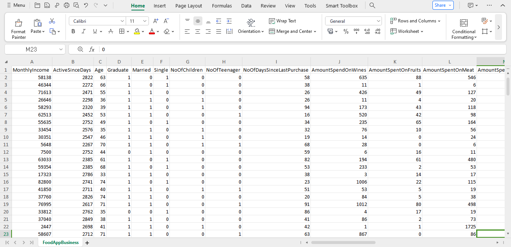
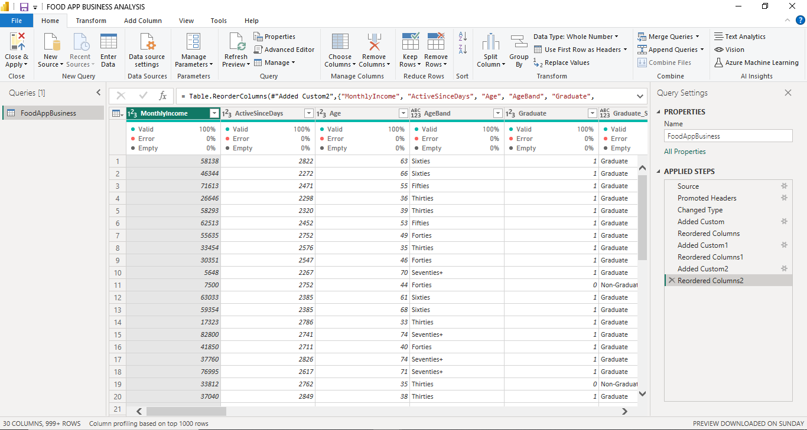
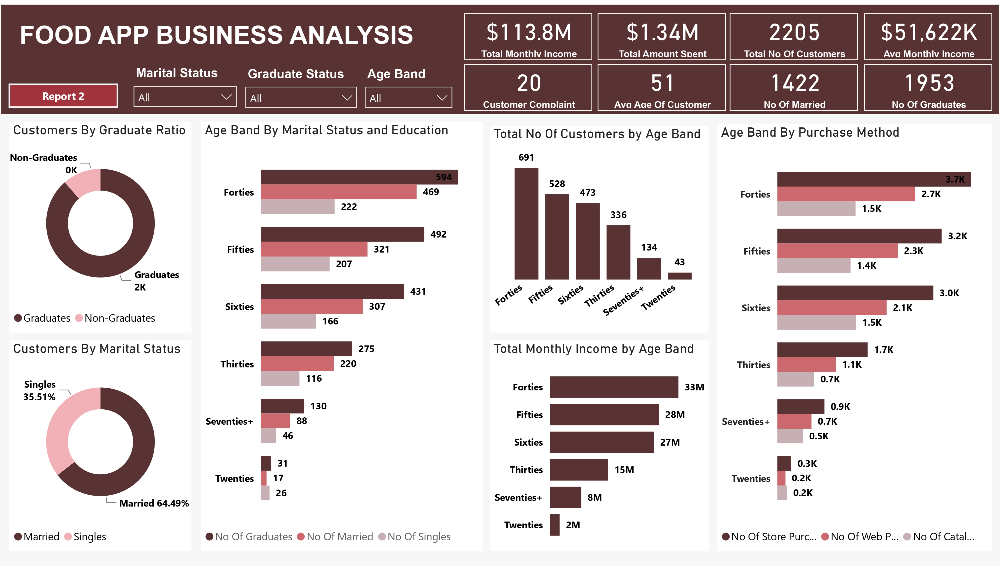
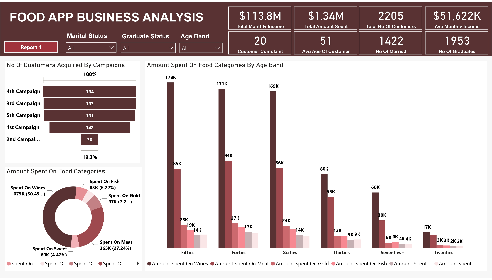
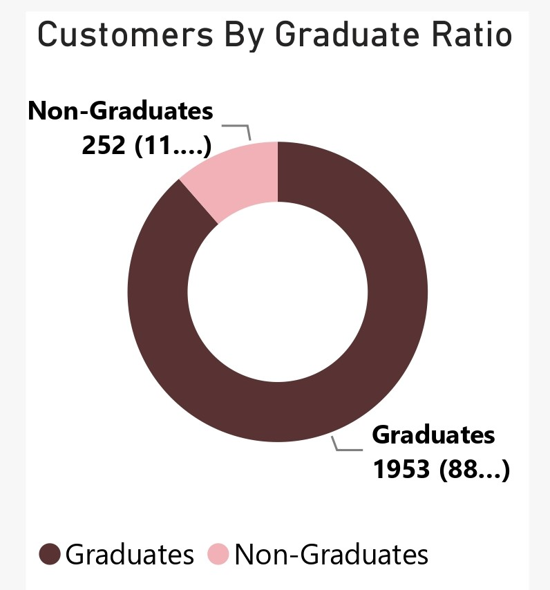
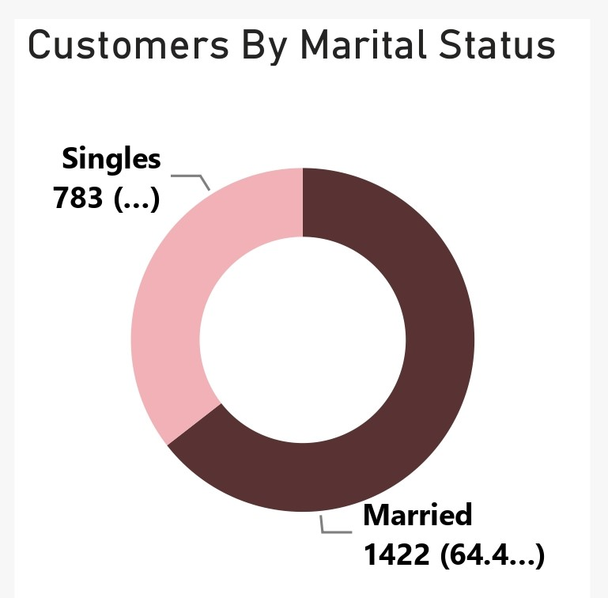
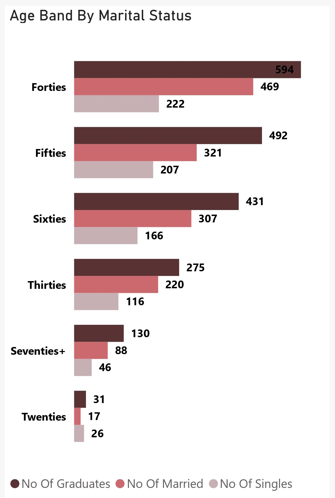
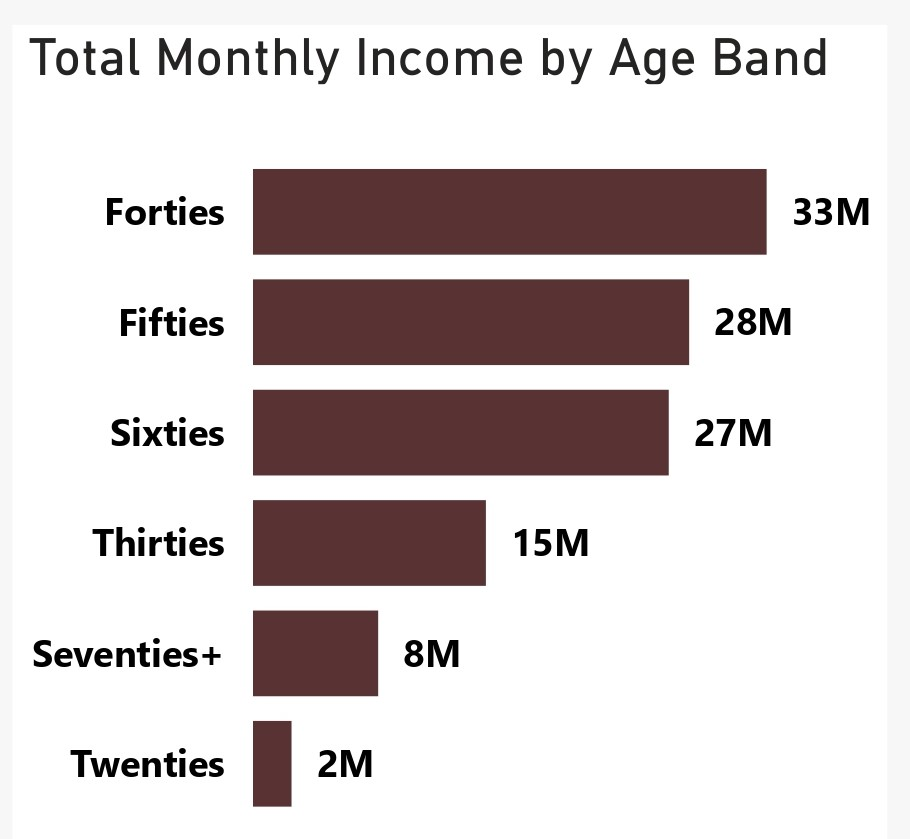
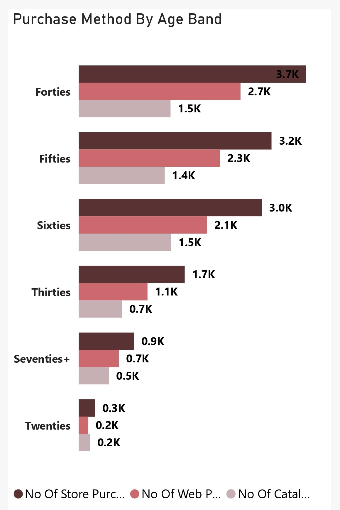

# Food-App-Business-Analysis

## Project Overview
### Introduction:
In today's digital age, the food industry has witnessed a significant transformation with the advent of food delivery business applications. These applications have revolutionized the way people order, consume, and experience food. This project aims to conduct a comprehensive analysis of the food app business, focusing on various aspects including market trends, customer demorgraphy, customer behavior, customer income, costumer purchase method, and provide insights for potential business growth.

### Objectives:
- To analyze the customer demorgraphy and the role their age, income, education status, and marital status plays in their Food purchase preferences
- To analyze customer preferences and behaviors regarding food ordering and delivery.
- To analyze the effecto of food campaigns on food sales for this food app business.
- To analyze the amount spent on food categories and purchasing method as influenced by customer demorgraphy
- To assess the impact of technological advancements on the food app business.
- To provide insights and recommendations for businesses operating in this space.

### Expected Findings:
1.  Analysis of Customer Demography and Purchase Preferences:
     - Understanding how age, income, education status, and marital status influence food purchase preferences.
     - Segmentation of customer preferences based on demographic factors to tailor marketing strategies.

2. Customer Preferences and Behaviors Regarding Food Ordering and Delivery:
     - Identification of preferred food categories, pricing sensitivity, and delivery preferences.
     - Analysis of factors influencing customer loyalty and satisfaction, such as delivery time and food quality.

3. Effect of Food Campaigns on Food Sales:
     - Evaluation of the impact of marketing campaigns and promotions on food sales.
     - Assessment of the effectiveness of different marketing channels in driving customer engagement and sales.

4. Amount Spent on Food Categories and Purchasing Method by Demography:
     - Analysis of spending patterns across different food categories (e.g., wines, meat, fish, sweet, fruits , gold).
     - Understanding how demographic factors influence the choice of purchasing method (e.g., store purchsases, web purchases, catalog purchases).

5. Impact of Technological Advancements:
     - Assessment of the role of technological innovations such as AI, data analytics, and delivery logistics in improving customer experience and operational efficiency.
     - Identification of emerging technologies with the potential to disrupt the food app business landscape.

6. Insights and Recommendations for the food app Business:
     - Providing actionable insights for the food app business to enhance their offerings, improve customer engagement, and stay competitive.
     - Recommendations for leveraging technology, optimizing marketing strategies, and catering to specific demographic segments effectively.

### About The Dataset
The "FoodAppBusiness.csv" dataset contains information related to the operations and transactions of a food app business. It includes various attributes that capture customer demographics, purchase preferences, transaction details, marketing campaigns, and technological advancements. The dataset is stored in a CSV (Comma Separated Values) format.
Each row represents a single observation or transaction, with each column capturing different attribute. The dataset has 27 columns and 2,205 rows. The dataset is in .csv file and can be viewed or downloaded [here](FoodAppBusiness.csv)

here's an overview of the "FoodAppBusiness.csv" dataset along with explanations of the column names:
1. MonthlyIncome: Monthly income of the customer.
2. ActiveSinceDays: Number of days since the customer has been active on the food app.
3. Age: Age of the customer.
4. Graduate: Binary variable indicating whether the customer is a graduate (1) or not (0).
5. Married: Binary variable indicating whether the customer is married (1) or not (0).
6. Single: Binary variable indicating whether the customer is single (1) or not (0).
7. NoOfChildren: Number of children the customer has.
8. NoOfTeenager: Number of teenagers the customer has.
9. NoOfDaysSinceLastPurchase: Number of days since the customer's last purchase on the food app.
10. AmountSpentOnWines: Amount spent by the customer on wines.
11. AmountSpentOnFruits: Amount spent by the customer on fruits.
12. AmountSpentOnMeat: Amount spent by the customer on meat.
13. AmountSpentOnFish: Amount spent by the customer on fish.
14. AmountSpentOnSweet: Amount spent by the customer on sweets.
15. AmountSpentOnGold: Amount spent by the customer on gold.
16. NoOfDealsWithDiscount: Number of deals the customer accepted with a discount.
17. NoOfWebPurchase: Number of purchases made by the customer via the web.
18. NoOfCatalogPurchase: Number of purchases made by the customer via catalogs.
19. NoOfStorePurchase: Number of purchases made by the customer in-store.
20. NoOfWebVisitsMonth: Number of web visits made by the customer in a month.
21. PurchasedIn1stCampaign:Binary variable indicating whether the customer made a purchase during the first campaign (1) or not (0).
22. PurchasedIn2ndCampaign: variable indicating whether the customer made a purchase during the second campaign (1) or not (0).
23. PurchasedIn3rdCampaign: variable indicating whether the customer made a purchase during the third campaign (1) or not (0).
24. PurchasedIn4thCampaign: variable indicating whether the customer made a purchase during the fourth campaign (1) or not (0).
25. PurchasedIn5thCampaign: variable indicating whether the customer made a purchase during the fifth campaign (1) or not (0).
26. TotalNoOfCampaignAccepted: Total number of marketing campaigns accepted by the customer.
23. CustomerComplain: Binary variable indicating whether the customer has complained (1) or not (0).

### Tools Used
1. Power Query Editor
    - Was used to:
        1. Extract,
        2. Transform, and
        3. Load all the datasets for this analysis.
           
2. Power BI (Was used to create reports and dashboard for this analysis)
    - The following Power BI Features were incorporated:
        1. DAX
        2. Quick Measures
        3. Page Navigation
        4. Filters
        5. Tooltips
        6. Button

### Data Cleaning, Transformation and Loading using the Power Query Editor:
1. Changed the column type for "MonthlyIncome" from text to Whole Number (int64).
2. Changed the column type for "ActiveSinceDays" to Whole Number (int64) from text.
3. Added a new column "AgeBand" which extracts its information from the "Age" column and groups them into: Twenties, Thirties, Forties, Fifties, Sixties, and Seventies+ using the 'If function'.
4. Added a new column "Graduate_Status" which picks its information from the "Graduate" column and transforms them by grouping them into 'Graduate' and 'Non-Graduate'. using the 'If fdunction'.
5. Added a new column "Marital_Status" from the "Married" column groups the data in the "Married" column into 'Married' and 'Single' using the 'If function'.
6. Re-ordered all columns accordingly.

**Raw Data**
- Below a screenshot of a part of the raw data in .csv file format which cannot be viewed fully here because of the enormous number of its columns (27 column). You can download the dataset [here](FoodAppBusiness.csv).

**Final Power Query Editor screenshot**
- Below a screenshot of a part of the cleaned data in power query editor which cannot be viewed fully here because of the number of its columns too. You can download the full Power BI project document [here](FOOD%20APP%20BUSINESS%20ANALYSIS.pbix).

## Visualization in Power BI:
#### Report 1

#### Report 2

### Analysis:
From the analysis, i made the Key Performance Indcator findings below:
- The Total Monthly Income from this Food App Business data $113.8M.
- The Average Mmonthly Income from this Food App Business is $51.622k
- The Total Amount Spent on all the food categories is $1.34M.
- The Total Number of Customers in this analysis is 2,205.
- The Average Age of Customers in this analysis is 51.
- The number of Customers that are Married is 1,422
- The number of Customers that are Graduates is 1,953
- The number of Customer Complaint is 20.
  
- 
- **Customers By Graduate Ration
- Analyzing this data from the aspect of Customers educational level, in the doughnut pie that represents "Customers By Graduate Ratio", we can see that Graduates makes a greater percentage ratio and number of customers in this analysis with 1,953 customers and a percentage of 88.57% while the Non-Graduates Customers are 252 in number with a percentage share of 11.43%. From this chart, we can see that educational may have influence buying decisions of customers.

- 
- **Customers By Marital Status**
- From the "Customers By Marital Status" doughnut chart, we could see that we have a graeater number of customers that are married with a customer count of 1,422 and a percentage ratio of 64.49% while the Singles has a customer count of 783 and a percentasge ratio of 35.51%. This indicates that we have a greater number of married customers in this analaysis and marital status must have played a role in the purchasing preferences, purchasing methods and the medium of purchases for these customers.

- 
- **Age Band By Marital Status**
- Diving deeper into the customer demography analysis, in the "Age Band By Marital Status and Education" clustered horizontal bar chart, we could see insightful patterns regarding the distribution of customers across different age bands, marital statuses, and education levels. Here's a breakdown of the findings:
  - Forties (40-49 years):
    This age band comprises the largest number of customers, with a total of 594 individuals. Among these customers, 469 are married, 
    indicating a significant portion of married individuals within this age group. Additionally, 222 customers in their forties are 
    single.
  - Fifties (50-59 years):
    Following closely, the age band of fifties accounts for 492 customers. Among them, 321 are married, indicating a relatively higher 
    proportion of married individuals compared to singles. 207 customers in their fifties are single.
  - Sixties (60-69 years):
    Customers in their sixties represent the third-largest group, totaling 431 individuals. Within this age band, 307 customers are 
    married, with a significant portion opting for marriage. There are 166 single customers in their sixties.
  - Thirties (30-39 years): The age band of thirties comprises 275 customers, ranking fourth in terms of customer count. Among them, 220 
    customers are married, showing a considerable proportion of married individuals. Additionally, 119 customers in their thirties are 
    single.
  - Seventy+ (70+ years): Customers aged seventy and above account for 130 individuals. Among them, 88 customers are married, with a 
    notable representation of married individuals in this age group. Additionally, there are 46 single customers in this age band.
  - Twenties (20-29 years): The age band of twenties represents the smallest group of customers, with a total count of 31 individuals.
    Interestingly, among these customers, there are 17 married individuals and 26 single individuals, indicating a higher proportion of 
    singles compared to married individuals in this age group.
  - This provides valuable insights into the composition of the customer base. A good understanding of these demographic patterns can 
    help the food app business tailor marketing strategies, product offerings, and customer engagement initiatives to better cater to 
    the preferences and needs of different customer segments. Further analysis and segmentation based on demographic factors can provide 
    deeper insights and opportunities for targeted marketing and personalized experiences to enhance customer satisfaction and loyalty.

- 
- **Total Monthly Income By Age Band**
- The distribution of total monthly income across different age bands provides valuable insights into customers' purchasing power and preferences. Here's an analysis of how income levels may influence their buying behavior:
  - Forties (40-49 years): Customers in their forties, with the highest total monthly income of $33 million, likely have significant 
    purchasing power. They may prioritize quality and convenience in their purchases, opting for higher-priced products and services.
    Preferences may include preference in luxury items within the food categories.
  - Fifties (50-59 years): With a total monthly income of $28 million, customers in their fifties also possess substantial purchasing 
    power. They may prioritize value for money and reliability in their purchases, seeking food products that offer longevity. 
    Preferences may include home improvements, health and wellness food products.
  - Sixties (60-69 years): Despite having a slightly lower total monthly income of $27 million, customers in their sixties still 
    maintain considerable purchasing power. They may prioritize convenience and comfort in their purchases, opting for food products and 
    services that enhance their lifestyle and well-being. Preferences may include healthcare products.
  - Thirties (30-39 years): With a total monthly income of $15 million, customers in their thirties exhibit moderate purchasing power.
    They may prioritize affordability and value in their food purchases, seeking products and services that offer a balance between 
    quality and cost-effectiveness. Preferences may include food products that align with their lifestyle and aspirations.
  - Seventies+ (70+ years): Despite having a lower total monthly income of $8 million, customers aged seventy and above still possess 
    purchasing power, albeit relatively lower compared to younger age groups. They may prioritize simplicity and reliability in their 
    purchases, opting for food products and services that meet their basic needs and preferences. Preferences may include healthcare 
    products, household food essentials, and investments in food prducts that helps them maintain their quality of life.
  - Twenties (20-29 years): Customers in their twenties, with the lowest total monthly income of $2 million, may have limited purchasing 
    power compared to older age groups. They may prioritize affordability and novelty in their purchases, seeking products and services 
    that align with their budget constraints and evolving preferences. Preferences may include trendy food products and experiences that 
    cater to their social and recreational interests.
  - The distribution of total monthly income across different age bands influences customers' purchasing power and 
    preferences, shaping their buying behavior and consumption patterns. Understanding these changes is crucial for the Food App 
    Businesses to tailor their product offerings, pricing strategies, and marketing campaigns to effectively target and engage with 
    diverse customer segments. By aligning with customers' income levels and preferences, businesses can optimize their market 
    positioning and enhance customer satisfaction, ultimately driving sales and fostering long-term loyalty.

- 
- **Purchase Method By Age Band**
- This analysis sheds light on how age influences the choice of purchase method. Here's an analysis of the findings:
  - Forties (40-49 years): Customers in their forties demonstrate a preference for store purchases, with 3,740 transactions recorded.
    They also show significant engagement in web purchases, with 2,661 transactions, indicating comfort with online shopping. Catalog 
    purchases, totaling 1,510 transactions, reflect a supplementary channel for their shopping needs. The forties age group exhibits a 
    balanced approach to purchasing, utilizing both traditional and digital channels based on convenience and preference.
  - Fifties (50-59 years): Similar to customers in their forties, those in their fifties display a preference for store purchases, with 
    3,171 transactions. Web purchases, totaling 2,324 transactions, also show a significant level of engagement, indicating a growing 
    comfort with online shopping among older demographics. Catalog purchases, with 1,414 transactions, serve as an additional avenue for 
    their shopping requirements. The fifties age group showcases a similar purchasing pattern to the forties, leveraging both offline 
    and online channels based on convenience and familiarity.
  - Sixties (60-69 years): Customers in their sixties exhibit a preference for store purchases, with 3,011 transactions, indicating a 
    continued reliance on traditional shopping methods. Web purchases, totaling 2,110 transactions, show a notable level of adoption, 
    reflecting increasing digital literacy and comfort with online transactions among older age groups. Catalog purchases, with 1,518 
    transactions, maintain a presence as an alternative shopping channel for this demographic. The sixties age group demonstrates a 
    gradual transition towards online shopping while still retaining a preference for traditional retail experiences.
  - Thirties (30-39 years): Customers in their thirties display a preference for store purchases, with 1,743 transactions, indicating a 
    reliance on brick-and-mortar retail outlets. Web purchases, totaling 1,131 transactions, demonstrate moderate engagement in online 
    shopping, reflecting a growing trend towards digital commerce among younger demographics. Catalog purchases, with 711 transactions, 
    serve as a supplementary channel for their shopping needs but are less prevalent compared to older age groups. The thirties age 
    group exhibits a balanced approach to purchasing, with a slight inclination towards traditional retail but a growing presence in 
    online transactions.
  - Seventies+ (70+ years): Customers aged seventy and above primarily rely on store purchases, with 909 transactions, reflecting a 
    preference for traditional shopping experiences. Web purchases, totaling 659 transactions, show a lower level of engagement compared 
    to younger age groups but indicate a gradual adoption of online shopping among older demographics. Catalog purchases, with 496 
    transactions, serve as a supplementary channel for this age group, providing additional convenience for their shopping needs. The 
    seventy and above age group demonstrates a cautious approach to online transactions while maintaining a preference for familia 
    retail environments.
  - Twenties (20-29 years): Customers in their twenties predominantly engage in store purchases, with 267 transactions, reflecting a 
    preference for immediate gratification and in-store experiences. Web purchases, totaling 157 transactions, indicate moderate 
    engagement in online shopping, with a growing trend towards digital commerce among younger demographics. Catalog purchases, with 184 
    transactions, serve as a secondary channel for this age group, catering to specific shopping preferences or niche food products. The 
    twenties age group demonstrates a balanced approach to purchasing, with a preference for traditional retail supplemented by 
    increasing engagement in online transactions.
  - Age plays a significant role in influencing the choice of purchase method, with different age groups demonstrating varying 
    preferences and levels of engagement across store, web, and catalog purchases. A good understanding of these preferences is 
    important for the Food App Businesses to tailor their omnichannel strategies, offering a seamless shopping experience that caters to 
    the diverse needs and preferences of different demographic segments. By adapting their marketing efforts and enhancing their online 
    and offline retail offerings, businesses can effectively engage with customers across all age groups, driving sales and fostering 
    long-term loyalty in an increasingly competitive retail landscape.

- 
- **No Of Customers Acquired Bby Campaigns**

11. Contact Information:
For further inquiries or collaboration opportunities, please contact [Your Name] at [Your Email Address] or [Your Phone Number].

